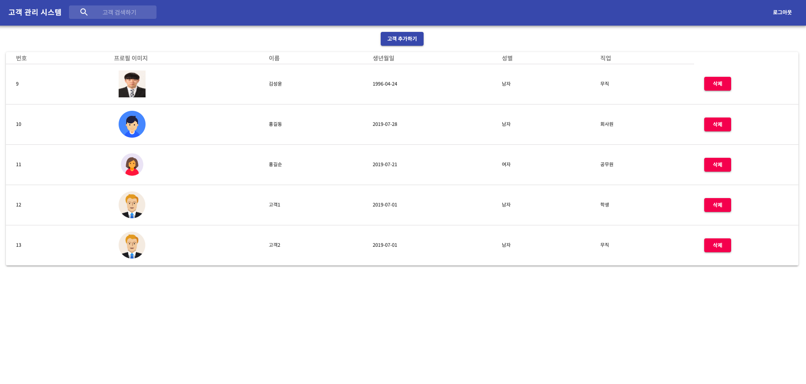

# 고객 관리 시스템

## 1.개요

 다수의 고객을 관리할수 있는 있는 React.js,GCP,Node.js 로개발한 웹 사이트 "고객 관리 시스템" 입니다.

  **[Sample ID]**

    ID: User / PW: 1111
    (현재 사이트는 미인증유저는 이용할수 없어 로그인을 해야 한다.)

  [사이트 바로가기](https://management-service-247514.appspot.com/)

## 2.개발 환경
- OS : Mac Mojave( version : 10.14.5 )
- 개발 언어 : Javascript
- 호스팅 및 배포 : Google Cloud Platform App Engine

  #### **1.Client**

  - 외부 라이브러리 :

  |
 Tool 
|
 사용목적 
|
 Version 
|
  |:----:|:------:|:-------:|
  | React.js | 클라이언트 개발 목적 | 16.8.6 |
  | axios | 웹서버와의 통신을 위해서 사용 | 0.18.0 |
  | react-mdl | 웹사이트 디자인 목적 | 1.11.0 |
  | material-ui | 웹사이트 디자인 목적 | 4.0.0 |
  | react-router-dom | URL주소의 맞는 view를 나누기 위해 | 5.0.1 |

  #### **2.Server**

  - 외부 라이브러리 :

  |
 Tool 
|
 사용목적 
|
 Version 
|
  |:----:|:------:|:-------:|
  | node.js | 서버 개발 목적 | 16.8.6 |
  | express | API 작성을 위해 사용 | 0.18.0 |
  |express-session| express 에서 세션을 관리하기 위해서 사용 |1.16.2|
  | mysql | node.js 와 mysql 연동을 위해서 사용 | 2.17.1 |
  | multer | 파일 업로드를 위해 사용되는 'multipart/form-data' 를 다루기 위해 사용 | 4.0.0 |
  | cors | cors 요청을 허용하기위해 사용 | 2.8.5 |
  | body-parser | POST 요청을 처리할때 사용자가 보낸 데이터를 추출하기 위해  | 1.18.3 |
  | @google-cloud/storage | 이미지 파일을 구글 스토리지에 업로드 하기 위해 사용 | 3.0.3 |

  #### **3.DB Server**

   - OS : Ubuntu 16.04 LTS
   - DB : MariaDB
   - Version : 10.1.40

   현재 이 서버는 윈도우10 환경의 Vmware 10 workstation 에서 가상 컴퓨팅환경에서 돌아가고있다. ( 서버또한 직접 구축해보고 싶어 가상 환경에서 MariaDB 를 선택해서 사용하였다. )

## 3.Apps View
   #### 1. API

  **- 고객 정보**

  [SampleURL](https://management-service-247514.appspot.com/api/customers)

  

  __/api/customers__ 로 요청을 하게되면 고객정보가 담겨있는 Json 데이터를 보내준다.

  | 
column
 | 
description
 |
  |:------:|:-----------:|
  |id | 고객를 구분하기 위한 primary key 값 (auto increment)|
  |image | 고객의 사진이 업로드된 구글 스토리지 주소 |
  |name | 고객 이름 |
  |gender | 고객 성별 |
  |job| 고객 직업 |
  |createDate| 고객이 등록된 시간 |
  |isDeleted | 값이 __"0"__ 이면 페이지에 보여주고 __"1"__ 이면 페이지에 보여주지 않는다.(페이지에서 직접 삭제하는것을 방지하기 위해) |

   #### 1.로그인

  현재 이 서비스는 Session이 발급이 안되어있는 유저(로그인이 안된 유저)는 이용할 수 없게 개발되어 있어 관리자가 로그인을 하게 되면 서버에선 Session을 발급해주고 고객 관리페이지로 이동할수 있다.

   
   

   **- Session 발급,유지,삭제**

   

   #### 2.고객 조회

   여러명의 고객을 한눈에 볼수 있게 Table로 고객을 볼수 있는 페이지 이다.

   

   #### 3.고객 추가

   Post로 고객의 데이터를 추가하게 되면 Google Storage 에는 사진이 업로드 되고, 데이터베이스에는 고객 사진이 업로드 되어있는 Google Storage 이미지 URL 과, 이름 , 생년월일, 성별, 직업이 등록 된다.

  - **고객 사진 선택**
      

  - **생년 월일 선택**

      

  - **직업 선택**

      

  #### 4. 고객 삭제

   

   한명의 고객 정보를 삭제하게 되면 데이터베이스에서 바로 삭제하는것이아닌 isDeleted 컬럼의 값을 1로 변경해서 페이지에서 보여주지 않고 데이터를 삭제하려면 관리자가 직접 데이터베이스에서 삭제하는 형식으로 개발 하였다.

  #### 5. 고객 검색

  

  
